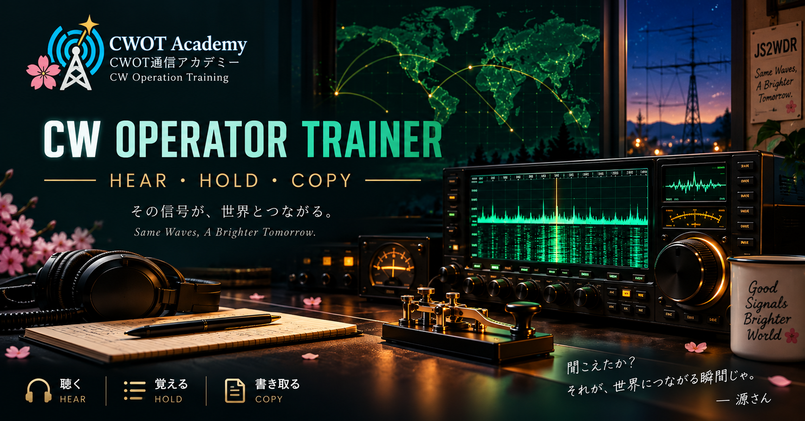

# CW Operator Trainer

<p align="center">
  
</p>

<p align="center">
  <strong>聞こえる、溜められる、書ける。</strong><br>
  欧文・和文モールスを、符号の習得から遅れ受信、第一級総合無線通信士の試験形式まで練習できるブラウザアプリです。
</p>

<p align="center">
  <a href="https://cw.conagi.jp/"><strong>https://cw.conagi.jp/</strong></a> — アカウント不要ですぐ練習できます<br>
  <a href="#ローカルで起動">Getting Started</a>
  ·
  <a href="#license">MIT License</a>
</p>

<p align="center">
  
  
  
  
</p>

## 公開サイト

本番環境は次のURLで利用できます。インストールやサインアップは不要で、ブラウザからそのまま練習を始められます。

**[https://cw.conagi.jp/](https://cw.conagi.jp/)**

学習データはこの端末のブラウザ内に保存されます。別端末や別ブラウザへ移す場合は、設定画面からJSONバックアップを使ってください。

## Overview

CW Operator Trainer は、CW受信に必要な能力を段階的に育てるトレーニングアプリです。

単なる符号暗記にとどまらず、音だけでの即答、Farnsworth間隔、コッホ法、数文字を頭に保持してから書く遅れ受信、取り違えの分析、本番形式の額表受信までを一つのアプリにまとめています。

- 国際モールスと和文モールスに対応
- サーバー、アカウント、外部API、APIキーは不要
- 学習履歴はブラウザ内に保存
- JSONによるバックアップと復元
- PWA対応。インストール後はオフラインでも練習可能

## 主な機能

| 機能 | 内容 |
| --- | --- |
| おぼえる | 合調法とリズムで1文字ずつ学習。聴く・数える・当てるの3段階で定着を確認します。 |
| 聴きとる | 1文字、単語、5字暗語、普通語、コールサイン、カスタム文などを音だけで練習できます。 |
| コッホ法 | 少ない文字から始め、昇級試験で90%以上を取ると次の文字を解放します。 |
| 遅れ受信 | 受信した文字を頭に保持し、古い順に入力するDelayed CopyをQueue深度別に訓練します。 |
| 苦手分析 | 混同行列、取り違えの方向、反応時間、苦手ペアを実際の回答履歴から可視化します。 |
| 一総通試験 | 和文普通語・欧文暗語・欧文普通語を、試験呼称、手続符号、額表、制限時間つきで練習できます。 |
| カード図鑑 | 習得した文字をカードとして収集。欧文、和文、数字・記号・手続符号を一覧できます。 |
| 音響設定 | 文字速度と実効速度、音量、波形、ピッチ、反響を調整できます。 |

## 学習コース

- **アマチュア欧文** — A–Zから開始し、数字・記号・手続符号へ拡張
- **アマチュア和文** — イロハからンまでの和文CW
- **第一級総合無線通信士** — 電気通信術を見据え、欧文・和文・手続符号を段階的に学習

コースを変更しても、習熟度や取得済みカードは保持されます。

## 第一級総合無線通信士・電気通信術モード

試験モードでは、受信開始の呼称から終了符号までを含む一連の流れを再現します。手書き練習用の視聴モードと、ブラウザ上で回答して採点する入力モードがあります。

| 科目 | 速度 | 構成 |
| --- | ---: | --- |
| 和文普通語 | 75字/分 | 2通・合計5枚（2+3または3+2） |
| 欧文暗語 | 80字/分 | 5字群 × 8群 × 5行を2通 |
| 欧文普通語 | 100字/分 | 自然な電報文を2通 |

各科目1,000セットを収録しています。普通語本文は話題ごとのシナリオから生成し、文や文節を途中で切らず、同一本文の重複を検査しています。欧文普通語は手続・通間休止を含む送信時間も生成時に検証します。

問題セットを再生成する場合:

```bash
npm run generate:exam-sets
```

生成元は [`scripts/generateExamSets.mjs`](./scripts/generateExamSets.mjs)、局名・船名・人名などの辞書は [`data/exam/dicts.json`](./data/exam/dicts.json) です。

> [!NOTE]
> 本プロジェクトは学習・練習用です。特定の官公庁、試験実施機関、無線団体による公式アプリではありません。実際の試験については最新の公式告示・案内を確認してください。

## ローカルで起動

### 必要環境

- Node.js 22.13.0以上
- npm
- Web Audio APIに対応したモダンブラウザ

### セットアップ

```bash
git clone https://github.com/accuex/CW_Operator_Trainer.git
cd CW_Operator_Trainer
npm install
npm run dev
```

表示されたURLをブラウザで開いてください。ブラウザの自動再生制限により、CW音声は最初の `PLAY` または `START` 操作後に再生されます。

### Google Analytics（任意）

本番ビルドで GA4 を使う場合のみ、Measurement ID を設定してください。未設定なら GA は読み込まれません。

```bash
cp .env.example .env.local
# .env.local に NEXT_PUBLIC_GA_MEASUREMENT_ID=G-XXXXXXXXXX を記入
npm run build
```

`NEXT_PUBLIC_*` はビルド時に埋め込まれるため、ID を変えたあとは再ビルドが必要です。

## コマンド

```bash
npm run dev                 # 開発サーバー
npm run build               # プロダクションビルド
npm run start               # ビルド済みアプリを起動
npm test                    # Vitestによるテスト
npm run lint                # ESLint
npm run generate:exam-sets  # 試験問題セットを再生成
```

## データとプライバシー

学習データ（回答履歴・進捗・設定）は外部サーバーへ送信されません。

- 音響設定と基本設定: `localStorage`
- 回答履歴、セッション、カード進捗、遅れ受信統計: `IndexedDB`
- バックアップ: 設定画面からJSONを書き出し・読み込み
- Google Analytics: `NEXT_PUBLIC_GA_MEASUREMENT_ID` を設定した本番ビルドのみ。学習内容は送りません

ブラウザのサイトデータを削除すると学習履歴も失われるため、必要に応じてJSONバックアップを保存してください。

## 技術構成

- React 19 / TypeScript
- Next.js 16互換構成 + Vinext / Vite
- Tailwind CSS 4
- Web Audio API
- IndexedDB / localStorage
- Vitest / ESLint
- Service Worker / Web App Manifest
- Cloudflare Workers対応

音声は事前収録ファイルではなく、モールス符号のtone eventをWeb Audio APIの時間軸へ配置して生成します。文字速度と実効速度を分離しているため、文字自体の速度を保ったまま語間・文字間隔を延ばすFarnsworth練習が可能です。

## ディレクトリ構成

```text
app/                 UI、画面、額表コンポーネント
lib/                 モールス定義、音響、採点、分析、保存処理
data/exam/           生成済み試験問題と辞書
scripts/             試験問題セット生成スクリプト
public/cards/        カードイラスト
public/fonts/        自前ホストの Web フォント（Geist / Geist Mono / M PLUS Rounded）
docs/                設計資料、試験形式の調査メモ
```

## カードイラストを追加する

カード画像は文字・符号・学習進捗と分離されています。画像内には文字情報を描き込まず、イラストのみを用意してください。

- 推奨サイズ: `1200 × 1800 px`（2:3、WebP推奨）
- 欧文: `public/cards/international/`
- 和文: `public/cards/wabun/`
- 数字・記号・手続符号: `public/cards/kigo/`
- 対応表: [`lib/cardArtwork.ts`](./lib/cardArtwork.ts)

manifestに画像がない場合や読み込みに失敗した場合は、CSSによるフォールバックカードを表示します。

## Contributing

IssueやPull Requestを歓迎します。変更前後で次を実行してください。

```bash
npm test
npm run lint
npm run build
```

試験問題を変更した場合は、`npm run generate:exam-sets` で生成結果を更新してください。OCR資料の文章をそのまま転載せず、形式や傾向を参考にした独自文章を使用します。

## License

This project is licensed under the [MIT License](./LICENSE).

(C) 2026 Int Design LLC.
